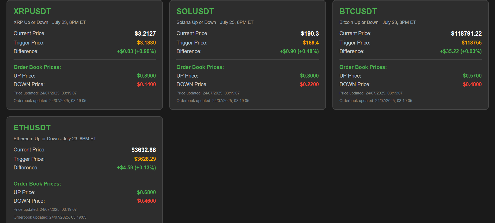

# Polymarket WebSocket Tracker

A real-time cryptocurrency price tracking dashboard using Polymarket data with WebSocket connections.

## Contact

📱 Telegram: [@wwafwt](https://t.me/wwafwt)

## Features

- Real-time price tracking
- WebSocket-based dashboard
- Flask-SocketIO backend
- Async data processing

## Screenshots



## Setup

1. Install dependencies from requirements file:
```bash
pip install -r requirements.txt
```

2. Run the application:
```bash
python app.py
```

3. Open browser to `http://localhost:5005`

## Files

- `app.py` - Main Flask application with WebSocket support
- `poly_m.py` - Crypto price tracker implementation
- `templates/dashboard.html` - Frontend dashboard (if exists)
- `requirements.txt` - Project dependencies
- `image.png` - Dashboard screenshot

## Usage

The dashboard will be available at http://localhost:5005 and provides real-time cryptocurrency price updates.

## Development

For questions or support, contact me on Telegram: [@wwafwt](https://t.me/wwafwt)
